<div align="center">

<!-- ═══════════════════════ HEADER ═══════════════════════ -->




</div>

<br>

<!-- ═══════════════════════ FASTFETCH ═══════════════════════ -->

```bash
┌─[rwfly06@cachyos]─[~]
└──╼ $ fastfetch

           .-------------------------:          rwfly06@github
          .+=========================.          ─────────────────────────
         :++===++==================-            OS       ⟩ CachyOS x86_64
        :*++====+++++=============-             Kernel   ⟩ linux-cachyos (BORE)
       -*+++=====+***++==========:              Uptime   ⟩ coding since day one
      =*++++========-----------:                Shell    ⟩ fish + starship
     =*+++++=====-                              WM       ⟩ Hyprland
   .+*+++++=-===:                               Editor   ⟩ Neovim / VS Code
  :++++=====-==:                                Theme    ⟩ Dark. Always dark.
 :++========-=.                                 Focus    ⟩ Clean code & speed
.+==========-.                                  Motto    ⟩ Optimize everything
 :+++++++====-
  :++==========.                                ██ ██ ██ ██ ██ ██ ██ ██
   .-===========:
```

<br>

<!-- ═══════════════════════ TECH STACK ═══════════════════════ -->

<div align="center">

### `⟩ pacman -S tech-stack`


<br><br>


</div>

<br>

<!-- ═══════════════════════ STATS ═══════════════════════ -->

<div align="center">

### `⟩ systemctl status github`


<br><br>


<br><br>


</div>

<br>

<!-- ═══════════════════════ PACMAN GRAPH ═══════════════════════ -->

<div align="center">

### `⟩ pacman --eat contributions`

<picture>
  <source media="(prefers-color-scheme: dark)" srcset="https://raw.githubusercontent.com/rwfly06/rwfly06/output/pacman-contribution-graph-dark.svg">
  <source media="(prefers-color-scheme: light)" srcset="https://raw.githubusercontent.com/rwfly06/rwfly06/output/pacman-contribution-graph.svg">
  
</picture>

</div>

<br>

<!-- ═══════════════════════ CONNECT ═══════════════════════ -->

<div align="center">

### `⟩ ping -c 1 rwfly06`

<a href="https://github.com/rwfly06"></a>
<a href="mailto:105841120324@student.unismuh.ac.id"></a>
<a href="https://www.instagram.com/rafly_rdh"></a>

<br><br>


<br><br>


<sub><code>~ Optimized for performance, designed for elegance ~</code></sub>

</div>
